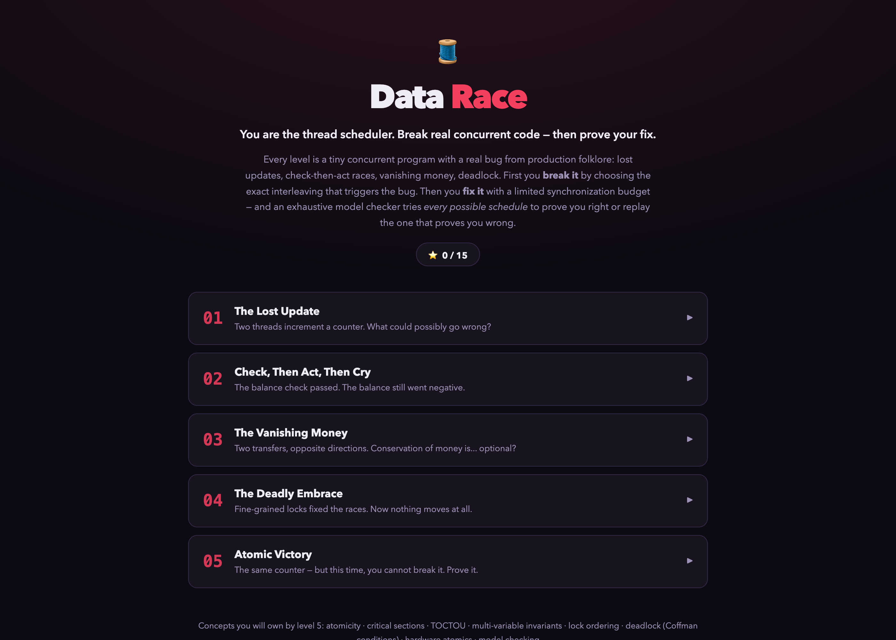
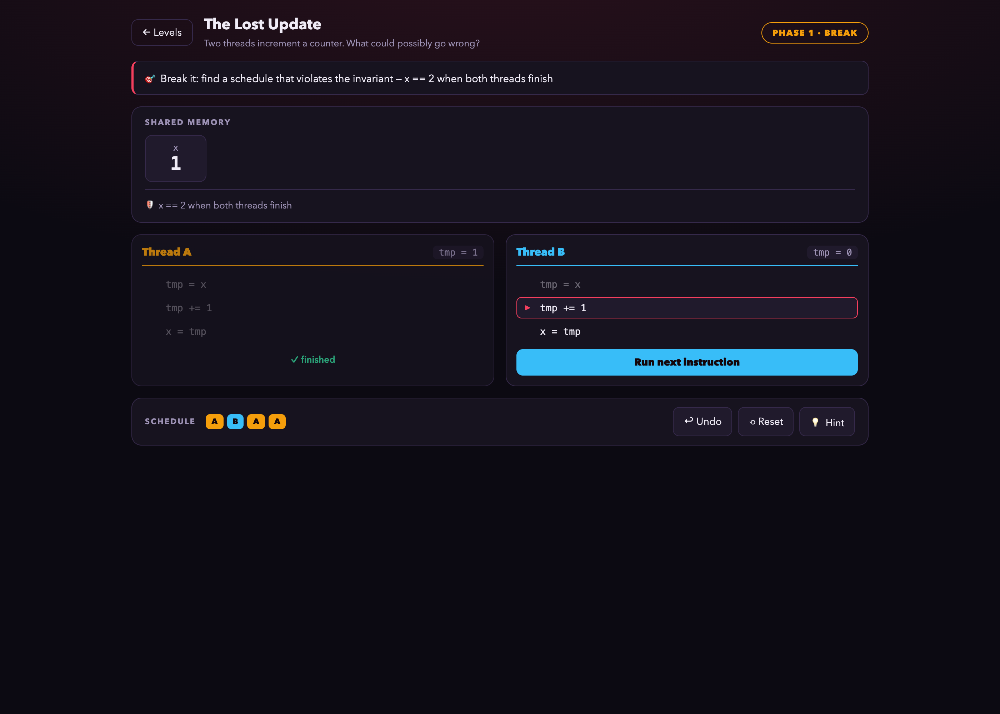
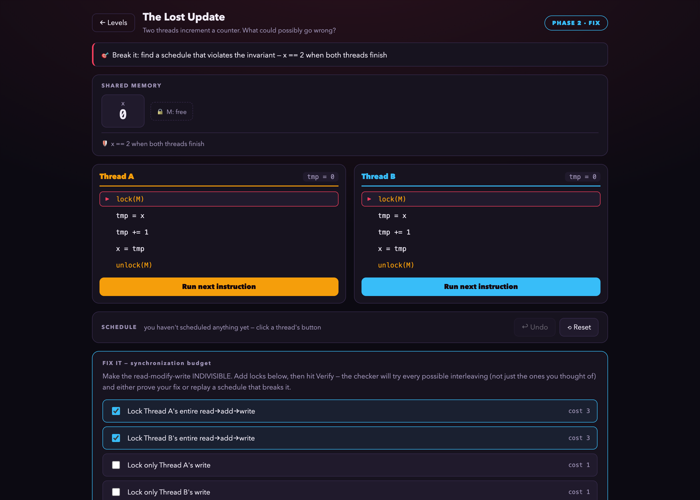
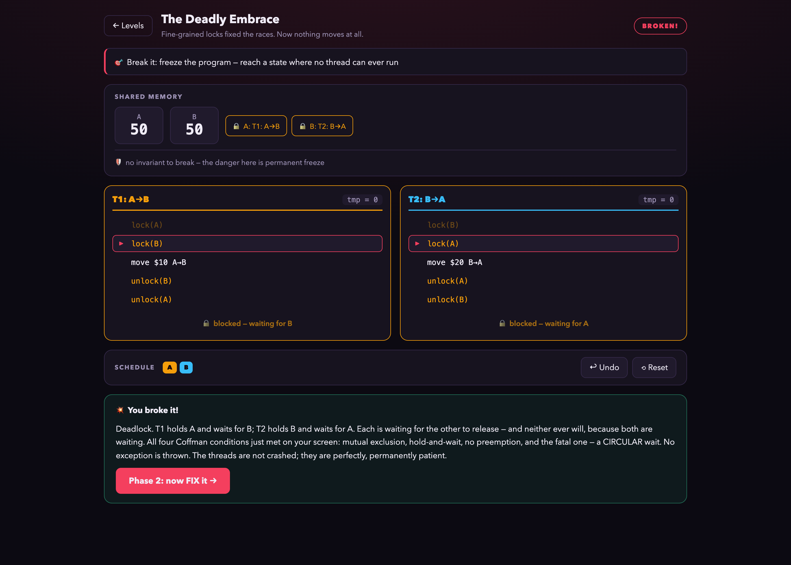

# Data Race

**You are the thread scheduler. Break real concurrent code — then prove your fix.**

Data Race is an interactive game that teaches concurrency the way production teaches it: by letting things go wrong. Every level is a tiny concurrent program with a classic bug — lost updates, check-then-act races, vanishing money, deadlock. You control the interleaving, one instruction at a time.

Each level has two phases:

1. **Break it.** Schedule the threads yourself and find the exact interleaving that violates the invariant (or freezes the program solid). When you succeed, the game explains precisely what you just did — in the language used in real incident reviews.
2. **Fix it.** Spend a limited synchronization budget on locks and refactorings. Then an **exhaustive model checker explores every reachable interleaving** — either certifying your fix (fewer locked instructions = more stars) or replaying, step by step, the schedule that breaks it. Decoy fixes that *look* right (lock just the write! lock just the money movement!) are on the menu, and the checker will happily demonstrate why they aren't.



## The curriculum (5 levels)

| # | Level | What it teaches |
| --- | --- | --- |
| 01 | The Lost Update | `x++` is three steps; atomicity of read-modify-write; why locking only the write fails |
| 02 | Check, Then Act, Then Cry | TOCTOU — a validated decision goes stale; the lock must span check *and* act |
| 03 | The Vanishing Money | Invariants spanning multiple variables need transaction-sized critical sections |
| 04 | The Deadly Embrace | Deadlock: Coffman conditions, circular wait, and the global lock-order cure |
| 05 | Atomic Victory | Hardware atomics dissolve races — and exactly where their power ends |







## Why a model checker in a game?

Concurrent code cannot be validated by testing the schedules you thought of — the bug is always in the one you didn't. The game makes that lesson mechanical: your fix is only accepted when a breadth-first search over the *entire* state space (every interleaving of every thread, including blocking and deadlocks) finds no violating schedule. When it finds one, you watch it execute. This is a real (small) model checker, the same idea behind TLA+ and SPIN.

## Running locally

```bash
npm install
npm run dev      # http://localhost:5173
```

Static app, no backend; progress lives in `localStorage`.

## How it works

```
src/
├── types.ts        # Instr, ThreadDef, Sim, LevelDef, Patch
├── engine.ts       # the interpreter (step semantics, blocking, deadlock detection)
│                   #   + the exhaustive checker (BFS over all interleavings)
├── levels.ts       # 5 levels: programs, invariants, patches, stories, lessons
└── components/
    ├── Play.tsx    # break/fix phases, scheduling UI, counterexample replay
    └── Home.tsx    # level select + progress
```

Threads run a tiny instruction set (`read`, `write`, `add`, conditional skip, `lock`/`unlock`, `atomic_add`) over shared integer variables. A "fix" is a patch that rewrites thread code (wrapping regions in locks, reordering acquisitions), so the player literally sees the lock instructions appear in the program they then have to schedule.

## Tech

React 19 · TypeScript · Vite · hand-rolled CSS · zero runtime dependencies beyond React

## License

MIT
